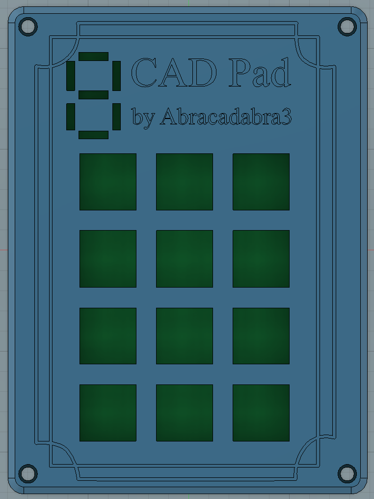
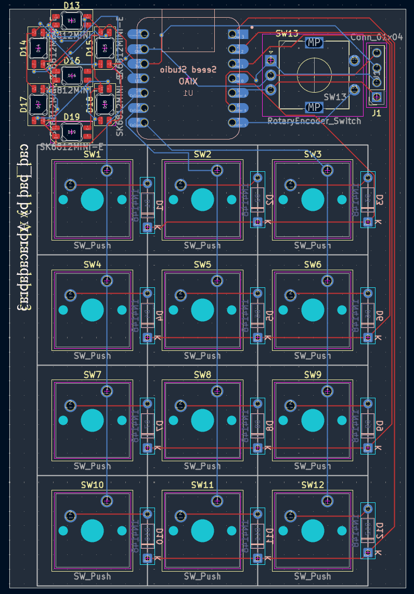
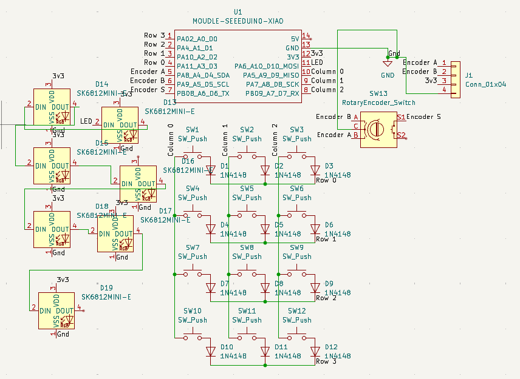

# CAD Pad
**A macropad with Autodesk Fusion shortcuts, a numberpad, and general shortcuts.**

## Features
- Layer 0: A numberpad
- Layer 1: Shortcuts for Autodesk Fusion
- Layer 2: General shortcuts for outside of Fusion
- Layer 3: Shorcuts for inside a Fusion sketch
- A shortcut for opening the parameter dialogue
- A made-from-scratch 7-segment display!

 
 

## BOM
- 1 unsoldered Seeed XIAO RP2040
- 12 through-hole 1N4148 diodes
- 12 MX-Style switches
- 12 blank DSA keycaps
- 7 SK6812 MINI-E LEDs
- 4 M3x16mm screws
- 4 M3x5x4mm heatset inserts
- 2 7 pin headers

## Design decisions
I chose the 12 key layout of the CAD Pad to mimic a numberpad and still have extra pins on the Seeeduino. The PCB has a connector for both a rotary encode and an OLED display. Neither are in the firmware right now and there is only enough pins for one at a time, but both are options for the future.
I didn't feel like figuring out how to use the OLED display, so instead I made a 7-segment display with LEDs and coded it to display the layer number!

## References
I followed many tutorials other than the [Stardance guide](https://hackpad.hackclub.com/guide) to making a macropad.
- [Creating a matrix in KiCad](youtube.com/watch?v=8WXpGTIbxlQ)
- [Setting up QMK](youtube.com/watch?v=hjml-K-pV4E)
- [Layers in QMK](keebsforall.com/blogs/mechanical-keyboards-101/how-to-add-layers-in-qmk)
- [Macros in QMK](getreuer.info/posts/keyboards/macros/index.html#simple-macros)
